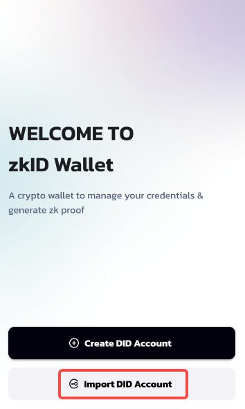
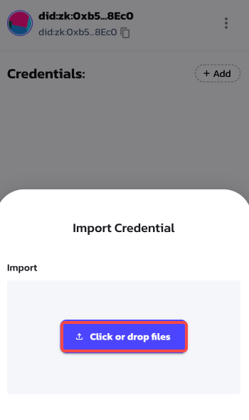

# zkID Wallet Tutorial V2.0

## 0.Add the zkID Wallet to your extension

You can add the zkID Wallet to your extension using the link below.

[https://chrome.google.com/webstore/detail/zkid-wallet/ahkpfejaeoepmfopmbhjgjekibmfcfgo?hl=en-US](https://chrome.google.com/webstore/detail/zkid-wallet/ahkpfejaeoepmfopmbhjgjekibmfcfgo?hl=en-US)

<figure><figcaption></figcaption></figure>

## 1.Main Processes

## Create DID Account

Step1: Click 'Create DID Account'

<figure><figcaption></figcaption></figure>

Step2: Create and Confirm your password

<figure><figcaption></figcaption></figure>

Step 3: Read the Notes of Recovery Seed Phrase

<figure><figcaption></figcaption></figure>

Step4: View and Save your Recovery Seed Phrase

<figure><figcaption></figcaption></figure>

Now you can see your Account Homepage:

<figure><figcaption></figcaption></figure>

### Import DID Account via Recovery Seed Phrase

Step1: Click 'Import DID Account'

<figure><figcaption></figcaption></figure>

Step2: Enter Recovery Pharse and Set Password

<figure><figcaption></figcaption></figure>

Now you can see your DID Account homepage

<figure><figcaption></figcaption></figure>

### Import Verifiable Credential (VC)

#### Import via Credential Platform

You can import your VC via the [Credential Platform](https://cred.zkid.app/#/claimer/claims).

Step1: Click 'Import to zkID Wallet'

<figure><figcaption></figcaption></figure>

Step2: Approve this action with your zkID Wallet

<figure><figcaption></figcaption></figure>

Step3: Confirm finishing this import

<figure><figcaption></figcaption></figure>

Now you can see your VC on your wallet homepage

<figure><figcaption></figcaption></figure>

#### Import via VC Files

Step1: Click 'Add'

<figure><figcaption></figcaption></figure>

Step2: Import the VC file

<figure><figcaption></figcaption></figure>

Step3: Confirm finishing the import

<figure><figcaption></figcaption></figure>

Now you can see your VC on your wallet homepage

<figure><figcaption></figcaption></figure>

## 2.Branching Processes

### Import DID Account via DID files

Step1: Click your DID profile photo to see the manage page

<figure><figcaption></figcaption></figure>

Step2: Click 'Import Account'

<figure><figcaption></figcaption></figure>

Step3: Select DID-Keys File and enter the file password and wallet password in order

<figure><figcaption></figcaption></figure>

Now you can see the account you imported.

<figure><figcaption></figcaption></figure>

### Delete DID Account

Step1: Click your DID profile photo to see the manage page

<figure><figcaption></figcaption></figure>

Step2: You can delete your DID Account files by following stepsNote: You can not delete the account that is currently active. For example, Account 1 in the photo is active.

<figure><figcaption></figcaption></figure>

### View Your Recovery Seed Phrase

Step1: Click your DID profile photo to see the manage page

<figure><figcaption></figcaption></figure>

Step2: Click 'Setting' to view the Setting page

<figure><figcaption></figcaption></figure>

Step3: Click 'Security'

<figure><figcaption></figcaption></figure>

Step4: Type your wallet password

<figure><figcaption></figcaption></figure>

Now you can view and copy your Recovery Seed Phrase

<figure><figcaption></figcaption></figure>

### View Verifiable Credential(VC)'s Details and Usage Record

You can click the VC to see the details.

<figure><figcaption></figcaption></figure>

Now you can see the details of this VC. If you want to remove it from your wallet, click the delete button.

<figure><figcaption></figcaption></figure>

You can also click 'USAGE RECORD' to view the record.

<figure><figcaption></figcaption></figure>

### Set the Auto-Lock Timer

Step1: Click your DID profile photo to see the manage page

<figure><figcaption></figcaption></figure>

Step2: Click 'Setting' to view the Setting page

<figure><figcaption></figcaption></figure>

Step3: Click 'Auto-Lock Timer'

<figure><figcaption></figcaption></figure>

You can set the Auto-Lock Timer here:

<figure><figcaption></figcaption></figure>

### View/Change Authorized App

Step1: Click your DID profile photo to see the manage page

<figure><figcaption></figcaption></figure>

Step2: Click 'Setting' to view the Setting page

<figure><figcaption></figcaption></figure>

Step3: Click 'Authorized Apps'

<figure><figcaption></figcaption></figure>

You can view and change the apps you authorized here:

<figure><figcaption></figcaption></figure>

### Create a new account based on your Recovery Seed Phrase

Step1: Click 'Create Account'

<figure><figcaption></figcaption></figure>

Step2: Set the name of the new account and confirm:

<figure><figcaption></figcaption></figure>
